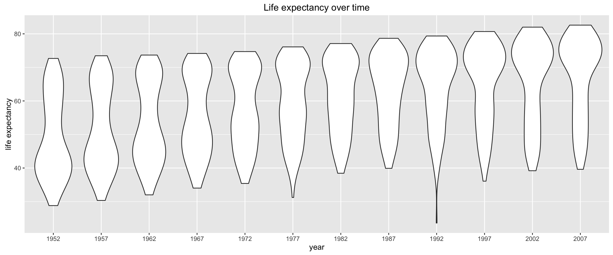
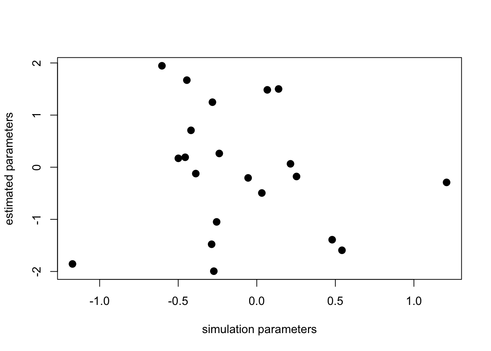

# Project 3

Posted: October 31, 2017

Last Updated: October 31, 2017

Due: November 17, 2017

## Part 1: Regression analysis of Gapminder data

In this part of this project you will practice and experiment with linear regression using data from <a href="http://gapminder.org">gapminder.org</a>. We recommend spending a little time looking at material there, it is quite an informative site.

We will use a subset of data provided by gapminder provided by <a href="http://www.stat.ubc.ca/~jenny/">Jennifer Bryan</a> described in it’s <a href="https://github.com/jennybc/gapminder">github page</a>.

Get the data from: https://github.com/jennybc/gapminder/blob/master/data-raw/08_gap-every-five-years.tsv

```
import pandas as pd
data = pd.read_csv("gap.tsv", sep='\t')
data.head()
```

```
## # A tibble: 6 × 6
##       country continent  year lifeExp      pop gdpPercap
##        <fctr>    <fctr> <int>   <dbl>    <int>     <dbl>
## 1 Afghanistan      Asia  1952  28.801  8425333  779.4453
## 2 Afghanistan      Asia  1957  30.332  9240934  820.8530
## 3 Afghanistan      Asia  1962  31.997 10267083  853.1007
## 4 Afghanistan      Asia  1967  34.020 11537966  836.1971
## 5 Afghanistan      Asia  1972  36.088 13079460  739.9811
## 6 Afghanistan      Asia  1977  38.438 14880372  786.1134
```

For this exercise you will explore how life expectancy has changed over 50 years across the world, and how economic measures like gross domestic product (GDP) are related to it.

**Exercise 1**: *Make a scatter plot of life expectancy across time.*

**Question 1**: *Is there a general trend (e.g., increasing or decreasing) for life expectancy across time? Is this trend linear? (answering this qualitatively from the plot, you will do a statistical analysis of this question shortly)*

A slightly different way of making the same plot is looking at the distribution of life expectancy across countries as it changes over time:

```
lggplot(aes(x='year', y='lifeExp'), data=data) +\
    geom_violin() +\
    labs(title="Life expectancy over time",
         x = "year",
         y = "life expectancy")</code></pre>
```



This type of plot is called a <em>violin plot</em>, and it displays the distribution of the variable in the y-axis for each value of the variable in the x-axis.

**Question 2**: <em>How would you describe the distribution of life expectancy across countries for individual years? Is it skewed, or not? Unimodal or not? Symmetric around it’s center?</em>

Based on this plot, consider the following questions.

**Question 3**: <em>Suppose I fit a linear regression model of life expectancy vs. year (treating it as a continuous variable), and test for a relationship between year and life expectancy, will you reject the null hypothesis of no relationship? (do this without fitting the model yet. I am testing your intuition.)</em>

**Question 4**: <em>What would a violin plot of residuals from the linear model in Question 3 vs. year look like? (Again, don’t do the analysis yet, answer this intuitively)</em>

**Question 5**: <em>According to the assumptions of the linear regression model, what <strong>should</strong> that violin plot look like?</em>

**Exercise 2**: <em>Fit a linear regression model using, e.g., the `LinearRegression` function from Scikit-Learn or the closed-form solution we derived in class, for life expectancy vs. year (as a continuous variable). </em>

**Question 6**: <em>On average, by how much does life expectancy increase every year around the world?</em>

**Question 7**: <em>Do you reject the null hypothesis of no relationship between year and life expectancy? Why?</em>

**Exercise 3**: <em>Make a violin plot of residuals vs. year for the linear model from Exercise 2.</em>

**Question 8**: <em>Does the plot of Exercise 3 match your expectations (as you answered Question 4)?</em>

**Exercise 4**: <em>Make a boxplot (or violin plot) of model residuals vs. continent.</em>

**Question 9**: <em>Is there a dependence between model residual and continent? If so, what would that suggest when performing a regression analysis of life expectancy across time?</em>

**Exercise 5**: <em>As in the Moneyball project, make a scatter plot of life expectancy vs. year, grouped by continent, and add a regression line.</em>

**Question 10**: <em>Based on this plot, should your regression model include an interaction term for continent <strong>and</strong> year? Why?</em>

**Exercise 6**: <em>Fit a linear regression model for life expectancy including a term for an interaction between continent and year.</em>

**Question 11**: <em>Are all parameters in the model significantly different from zero? If not, which are not significantly different from zero?</em>

**Question 12**: <em>On average, by how much does life expectancy increase each year for each continent? (Provide code to answer this question by extracting relevant estimates from model fit)</em>

**Exercise 7**: <em> Perform an F-test that compares how well two models fit your data: (a) the linear regression models from Exercise 2 (only including year as a covariate) and (b) Exercise 6 (including interaction between year and continent).</em>

**Question 13**: <em>Is the interaction model significantly better than the year-only model? Why?</em>

**Exercise 8**: <em>Make a residuals vs. year violin plot for the interaction model. Comment on how well it matches assumptions of the linear regression model. Do the same for a residuals vs. fitted values model.</em>


## Part 2: Classification

### Gradient Descent

<p><strong>Problem 1</strong> <em>Implement the gradient descent algorithm (either batch or stochastic versions) for multiple linear regression. I.e., extend the version of the algorithm in the lecture notes to multiple parameters.</em></p>
<p>The gradient descent update equation for logistic regression is given by:</p>

<!--
<p><span class="math display">\[
\beta^{k+1} = \beta^k + \alpha \sum_{i=1}^{n} (y_i - p_i(\beta^k))\mathbf{x_i}
\]
-->


<p>where (from the definition of log-odds):</p>

<!--
<p><span class="math display">\[
p_i(\beta^k) = \frac{e^{f_i(\beta^k)}}{1+e^{f_i(\beta^k)}}
\]</span></p>
-->


<p>and
<!--
<span class="math inline">\(f_i(\beta^k) = \beta_0^k + \beta_1^k x_{i1} + \beta_2^k x_{i2} + \cdots + \beta_p^k x_{ip}\)</span>.</p>
-->

</p>

<p><strong>Problem 2</strong> <em>Derive the above update equation</em>. Write the derivation in a markdown ipynb cell. </p>
<p><strong>Problem 3</strong> <em>Implement the gradient descent algorithm (either batch or stochastic versions) for multiple logistic regression.</em> I.e., modify your code in problem 1 for the logistic regression update equation.</p>
<p>Make sure you include in your submission writeup, which version of the algorithm you are solving (stochastic or batch), and make sure to comment your code to help us understand your implementation.</p>
<p><strong>Problem 4</strong> To test your programs, simulate data from the linear regression and logistic regression models and check that your implementations recover the simulation parameters properly.</p>
<p>Use the following functions to simulate data for your testing:</p>

<pre class="r"><code>
&#35;simulate data for linear regression

gen_data_x, gen_data_y = sklearn.datasets.make_regression(n_samples=100, n_features=20, noise = 1.5)

&#35;simulate data for logistic regression.  This is similar to linear, only now values are either 0 or 1.  
log_gen_data_x, dump_y = sklearn.datasets.make_regression(n_samples=100, n_features=20, noise = 1.5)
log_gen_data_y = [0 if i>0 else 1 for i in dump_y]}</code></pre>

<p>You can use this function as follows in your submission:</p>
<pre class="r"><code>
&#35;a really bad estimator
&#35;returns random vector as estimated parameters
dummy = np.ndarray([100, 20])
for index, row in enumerate(dummy):
    dummy[index] = np.random.normal(0, .1, 20)
plt.plot(gen_data_x, dummy)</code></pre>



<p>Include a similar plot in your writeup and comment on how your gradient descent implementation is working.</p>
</div>
<div id="try-it-out" class="section level2">

<h3>Try it out!</h3>

<ol style="list-style-type: lower-alpha">
<li><p>Find a dataset on which to try out different classification (or regression) algorithms. </p></li>
<li><p>Choose <strong>two</strong> of the following algorithms:</p></li>
</ol>
<ol style="list-style-type: decimal">
<li>Linear Discriminant Analysis (LDA) (only classification)</li>
<li>classification (or regression) trees,</li>
<li>random forests<br />
</li>
<li>linear SVM,</li>
<li>non-linear SVM</li>
<li>k-NN classification (or regression)</li>
</ol>
<p>and compare their prediction performance on your chosen dataset to your logistic regression gradient descent implementation using 10-fold cross-validation and a paired t-test (one for each of the two algorithms vs. your logistic regression code). Note: for those algorithms that have hyper-parameters, i.e., all of the above except for LDA, you need to specify in your writeup which model selection procedure you used.</p>
</div>


<div id="handing-in" class="section level2">

<h3>Handing in:</h3>

<ol style="list-style-type: decimal">
<li><p>For Problems 1 and 3 include your code in the writeup. Make sure they are commented and that the code is readable in your final writeup (e.g., check line widths).</p></li>
<li><p>For Problem 2, include the derivation of the gradient descent update in the writeup</p></li>
<li><p>For Problem 4, make sure you run the provided code and include the output in the writeup.</p></li>
<li><p>For the next section organize your writeup as follows:</p></li>
</ol>
<ol style="list-style-type: lower-alpha">
<li><p>Describe the dataset you are using, including: what is the outcome you are predicting (remember this should be a classification task) and what are the predictors you will be using.</p></li>
<li><p>Include code to obtain and prepare your data as a dataframe to use with your three classification algorithms. In case your dataset includes non-numeric predictors, include the code you are using to transform these predictors into numeric predictors you can use with your logistic regression implementation.</p></li>
<li><p>Specify the two additional algorithms you have chosen in part (b), and for algorithms that have hyper-parameters specify the method you are using for model selection.</p></li>
<li><p>Include all code required to perform the 10-fold cross-validation procedure on your three algorithms.</p></li>
<li><p>Writeup the result of your 10-fold cross-validation procedure. Make sure to report the 10-fold CV error estimate (with standard error) of each of the three algorithms. Also report on the result of the <em>two</em> paired t-tests comparing your logistic regression algorithm with your chosen two algorithms.</p></li>
</ol>
